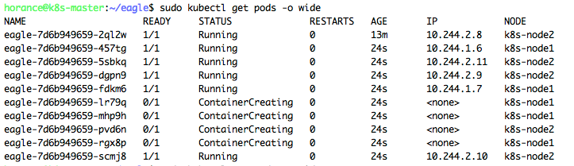
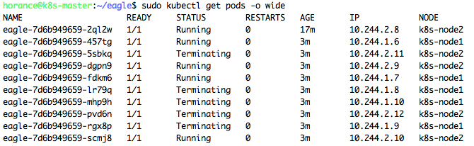

# 破冰之旅

当Kubernetes集群创建成功后，便可以开始部署第一个应用了。

### 构建镜像

这里使用Node.js创建一个简单HTTP服务器，当它收到HTTP请求时，向对端打印当前Pod的名字(等于主机名)。

```bash
horance@host:~$ mkdir eagel && cd eagel
```

```js
horance@host:~/eagel$ cat <<EOF > main.js
const os = require('os');
console.log("http server starting...");

var handler = function(req, rsp) {
  console.log("req from: " + req.connection.remoteAddress);
  rsp.writeHead(200);
  rsp.end("pod_name: " + os.hostname() + "\n");
};

const http = require('http');
var server = http.createServer(handler);
server.listen(8080);
EOF
```

创建Dockerfile。

```bash
horance@host:~/eager$ cat <<EOF > Dockerfile
FROM node:9
ADD main.js /main.js
ENTRYPOINT ["node", "main.js"]
EOF
```

构建镜像。

```bash
horance@host:~/eager$ sudo docker build -t horanceliu/eagle .
```

登录DockerHub。

```bash
horance@host:~/eager$ sudo docker login
```

最后，将该镜像推送到DockerHub上去。

```bash
horance@host:~/eager$ sudo docker push horanceliu/eagle
```

### 部署应用

```bash
horance@k8s-master:~$ sudo kubectl run eagle --image=horanceliu/eagle --port 8080
```


```bash
horance@k8s-master:~$ kubectl get pods
```


```bash
horance@k8s-master:~$ kubectl describe pod eagle-7d6b949659-22xkl
```


### ReplicaSet

```
horance@k8s-master:~/eagle$ kubectl describe replicaset eagle-7d6b949659
```


### Deployment

```
horance@k8s-master:~/eagle$ kubectl describe deployment eagle
```


```
horance@k8s-master:~/eagle$ kubectl edit deployment eagle
```


## 使用Yaml

相对于命令行，可以使用Yaml文件部署应用。

```
horance@k8s-master:~$ sudo kubectl apply -f deployment.yml
```

```yaml
apiVersion: extensions/v1beta1
kind: Deployment
metadata:
  labels:
    run: eagle
  name: eagle
spec:
  replicas: 1
  selector:
    matchLabels:
      run: eagle
  template:
    metadata:
      labels:
        run: eagle
    spec:
      containers:
      - image: horanceliu/eagle
        imagePullPolicy: Always
        name: eagle
        ports:
        - containerPort: 8080
          protocol: TCP
```


```
horance@k8s-master:~$ sudo kubectl get pods
```


## 扩容

```
horance@k8s-master:~$ sudo kubectl apply -f deployment.yml
```

```yml
apiVersion: extensions/v1beta1
kind: Deployment
metadata:
  labels:
    run: eagle
  name: eagle
spec:
  replicas: 10
  selector:
    matchLabels:
      run: eagle
  template:
    metadata:
      labels:
        run: eagle
    spec:
      containers:
      - image: horanceliu/eagle
        imagePullPolicy: Always
        name: eagle
        ports:
        - containerPort: 8080
          protocol: TCP
```

等价于执行如下命令。

```
horance@k8s-master:~$ sudo kubectl scale deployment eagle --replicas=10
```




## 缩容

```
horance@k8s-master:~$ sudo kubectl apply -f deployment.yml
```

```yml
apiVersion: extensions/v1beta1
kind: Deployment
metadata:
  labels:
    run: eagle
  name: eagle
spec:
  replicas: 5
  selector:
    matchLabels:
      run: eagle
  template:
    metadata:
      labels:
        run: eagle
    spec:
      containers:
      - image: horanceliu/eagle
        imagePullPolicy: Always
        name: eagle
        ports:
        - containerPort: 8080
          protocol: TCP
```

等价于执行如下命令。

```
horance@k8s-master:~$ sudo kubectl scale deployment eagle --replicas=5
```




## 创建Service

```
horance@k8s-master:~$ sudo kubectl apply -f service.yml
```

```yml
apiVersion: v1
kind: Service
metadata:
  name: eagle-srv
spec:
  selector:
    run: eagle
  ports:
  - name: https
    protocol: TCP
    port: 80
    targetPort: 8080
```

```
horance@k8s-master:~$ kubectl get services
```


```
horance@k8s-master:~$ curl 10.96.97.146
```

多次运行，会发现eagle-srv将相应的HTTP请求负载均衡到后端不同的Pod上执行。

```
horance@k8s-master:~$ kubectl exec eagle-7d6b949659-b752r -it bash
root@eagle-7d6b949659-b752r:/# curl http://eagle-srv
```


