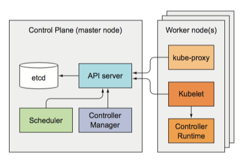
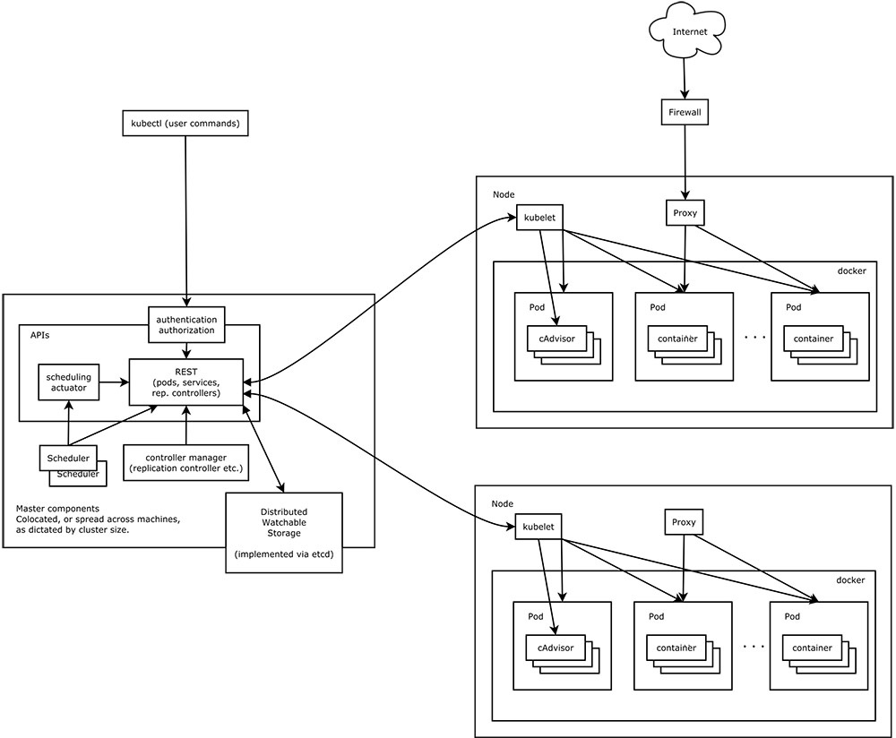
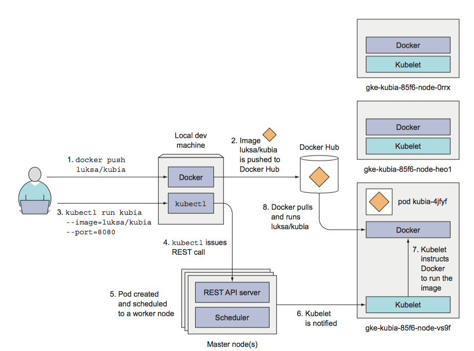
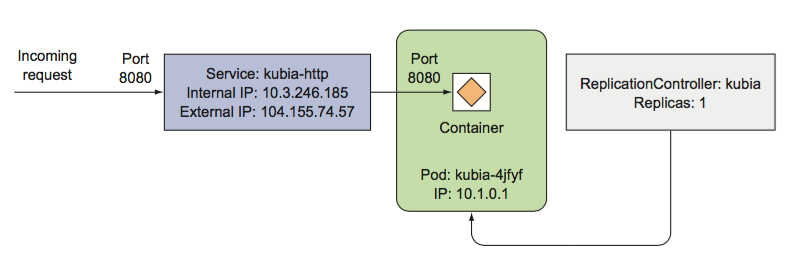
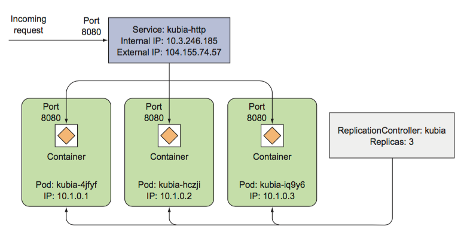

# Kubernetes Architecture




Kubernetes system components communicate only with the API server. They don’t talk to each other directly. The API server is the only component that communicates with etcd. None of the other components communicate with etcd directly, but instead modify the cluster state by talking to the API server.

While multiple instances of etcd and API server can be active at the same time and do perform their jobs in parallel, only a single instance of the Sched- uler and the Controller Manager may be active at a given time—with the others in standby mode.

The Control Plane components, as well as kube-proxy, can either be deployed on the system directly or they can run as pods.

The Kubelet is the only component that always runs as a regular system compo- nent, and it’s the Kubelet that then runs all the other components as pods. To run the Control Plane components as pods, the Kubelet is also deployed on the master. 




## First App

### 创建一个Pod

```
$ kubectl run kubia --image=luksa/kubia --port=8080 --generator=run/v1
```

```
$ kubectl get pods
NAME          READY     STATUS    RESTARTS   AGE
kubia-4jfyf   1/1       Running   0          5m
```

```
$ kubectl get pods -o wide
NAME          READY   STATUS    RESTARTS   AGE   IP         NODE
kubia-hczji   1/1     Running   0          7s    10.1.0.2   gke-kubia-85f6-node-vs9f/10.132.0.3
```

```
$ kubectl describe pod kubia-hczji
Name:        kubia-hczji
Namespace:   default
Node:        gke-kubia-85f6-node-vs9f/10.132.0.3
Start Time:  Fri, 29 Apr 2016 14:12:33 +0200
...
```



## 创建LB

```
$ kubectl expose rc kubia --type=LoadBalancer --name kubia-http
service "kubia-http" exposed
```

```
$ kubectl get services
NAME         CLUSTER-IP     EXTERNAL-IP   PORT(S)         AGE
kubernetes   10.3.240.1     <none>        443/TCP         35m
kubia-http   10.3.246.185   104.155.74.57 8080:31348/TCP  1m
```


```
$ curl 104.155.74.57:8080
You’ve hit kubia-4jfyf
```




### 扩容

```
$ kubectl scale replicationcontroller kubia --replicas=3
```


```
$ kubectl get rc
NAME        DESIRED    CURRENT   READY   AGE
kubia       3          3         2       17m

$ kubectl get pods
NAME          READY     STATUS    RESTARTS   AGE
kubia-hczji   1/1       Running   0          18m
kubia-iq9y6   0/1       Pending   0          7s
kubia-4jfyf   1/1       Running   0          7s
```



负载均衡

```
$ curl 104.155.74.57:8080
You’ve hit kubia-hczji
$ curl 104.155.74.57:8080
You’ve hit kubia-iq9y6
$ curl 104.155.74.57:8080
You’ve hit kubia-iq9y6
$ curl 104.155.74.57:8080
You’ve hit kubia-4jfyf
```

