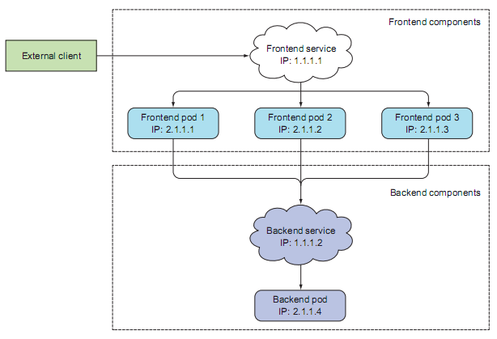
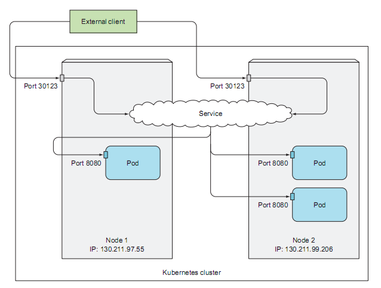
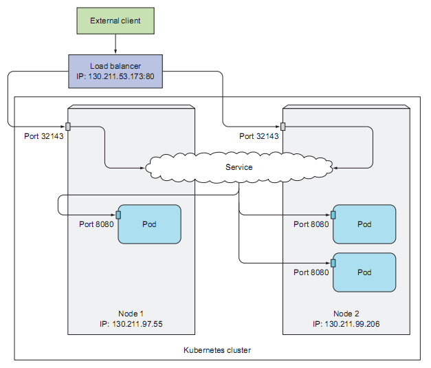
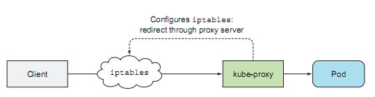
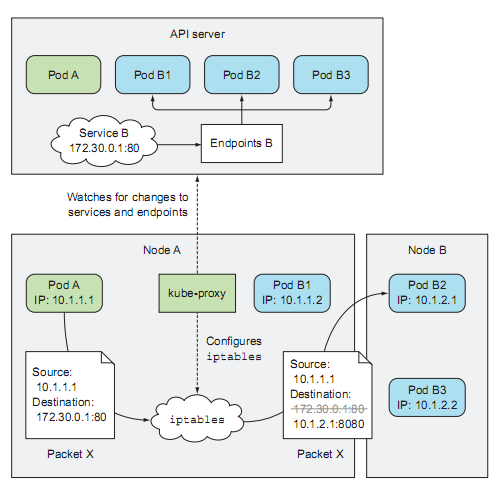

## Service

### 初衷

#### 临时性

在整个Kubernetes集群的运维过程中，Pod的生命周期是一个动态的过程，Pod的创建和销毁是一件很平常的事情。

当实施扩容时，导致Pod被动态创建；当实施缩容时，Pod被动态销毁。

当镜像版本升级时，就的Pod被销毁，新的Pod被创建；当镜像版本降级时，新的Pod被销毁，就的Pod被回滚。

当Pod所在的Node一旦发生宕机，其上的所有Pod将被重新调度到其他Node上执行。

总之，Pod是临时的，其PodIP随时可能会发生变化。

#### 动态分配PodIP

当且仅当Pod被准确地调度到特定的Node节点上执行时，才会动态分配PodIP；之前，无法获取PodIP，因此不能将PodIP作为Pod对外稳定的通信基础设施。

#### 可扩展性

可能存在多个Pod的实例，提供水平扩展的能力，其每个Pod实例都拥有相应的PodIP。显然，不能让用户关心所有的PodIP。

#### 关键抽象：Service

既然PodIP不稳定，那就提供一个更抽象的ServiceIP，从而使得用户依赖于相对稳定的抽象。

Service是对一组动态Pod列表的统一抽象。它对外提供稳定的ServiceIP，并对后端Pod列表的访问实施负载均衡。

### 一个例子



#### 两种Pod

存在两种类型的Pod，前端Web服务及其后端数据存储。其中，前端Web服务是无状态的，可以轻松实现水平扩展，并提供高并发的数据访问。后端数据存储此处提供单一的Pod实例。

#### 两个Service

提供前端Service，实现对前端Pod列表访问的负载均衡，及其稳定的外部访问的抽象。支持前端Pod列表的动态扩容和缩容，动态升级和降级。

后端Service，实现集群内部的Pod访问后端数据存储Pod的稳定抽象。实现后端数据存储Pod的动态变化，从而实现两者的解耦。

### 标签选择器

```
$ sudo kubectl apply -f eagle.yaml
```

```yml
apiVersion: extensions/v1beta1
kind: Deployment
metadata:
  name: eagle
spec:
  replicas: 5
  selector:
    matchLabels:
      run: eagle
  template:
    metadata:
      labels:
        run: eagle
    spec:
      containers:
      - image: horanceliu/eagle
        name: eagle
        ports:
        - containerPort: 8080

---

apiVersion: v1
kind: Service         
metadata:
  name: eagle        
spec:
  ports:
  - port: 80          
    targetPort: 8080  
  selector:
    run: eagle        
```


### 访问Service

```
$ kubectl exec eagle-7d6b949659-b752r -it bash -- curl -s http://eagle
```


### NodePort



### LB




### kube-proxy

#### 用户空间



#### 内核空间


### 工作原理



#### 监听

#### 重定向

