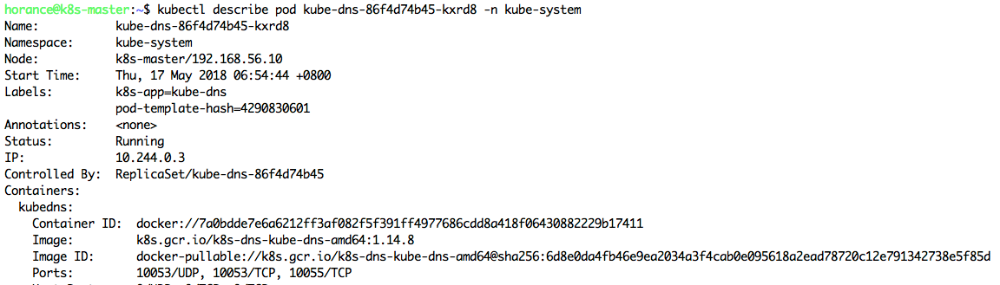

## 创建Kubernetes集群

使用kubeadm可以很方便地创建多节点的Kubernetes集群。

### 初始化Master

在k8s-master执行如下命令，用于初始化Kubernetes集群的Master，拉起Master相关服务。

```
horance@k8s-master:~$ sudo kubeadm init --apiserver-advertise-address 192.168.56.10 --pod-network-cidr=10.244.0.0/16
```

其中，使用`--pod-network-cidr`选项配置`PodCIDR`，Kubernetes创建的Pod将从该网段自动分配IP地址。使用`--apiserver-advertise-address`显式指定apiserver的地址。

此时，Master会连接官方k8s.gcr.io的Docker Registry拉取如下镜像：

- k8s.gcr.io/kube-etcd-amd64
- k8s.gcr.io/kube-apiserver-amd64
- k8s.gcr.io/kube-controller-manager-amd64 
- k8s.gcr.io/kube-scheduler-amd64

另外，包括两个附加镜像。
- k8s.gcr.io/kube-proxy-amd64
- k8s.gcr.io/k8s-dns-kube-dns-amd64

后文将详细解释为什么会拉取这些镜像。初始化成功后，终端提示配置命令行工具kubectl，创建Pod网络，及其添加Node节点到该Kubernetes集群的方法。


### 配置kubectl

```
horance@k8s.master$ mkdir -p $HOME/.kube
horance@k8s.master$ sudo cp -i /etc/kubernetes/admin.conf $HOME/.kube/config
horance@k8s.master$ sudo chown $(id -u):$(id -g) $HOME/.kube/config
```

### 安装Flannel

为了能够支持Pod之间互相通信，Kubernetes支持多种网络方案，此处选择安装Flannel。访问flannel在Github的手册，执行如下命令按照Flannel网络。

```bash
horance@k8s-master:~$ kubectl apply -f https://raw.githubusercontent.com/coreos/flannel/master/Documentation/kube-flannel.yml
```


### 添加Node

根据提示，将k8s-node1添加到该Kubernetes集群中。

```bash
horance@k8s-node1:~$ sudo kubeadm join 192.168.56.10:6443 --token 75l5tx.cc5artnk3xj5apxx --discovery-token-ca-cert-hash sha256:ed27350fae238fb1a54c8ee3d913652a3b640498122eb2ce554477a85565db85
```


依次类推，将k8s-node2添加到该Kubernetes集群中，不再冗述。

### 查看节点

使用如下命令查看集群中管理的所有节点，及其状态信息。

```bash
horance@k8s-master:~$ kubectl get nodes
```


使用如下命令查看某一节点的详细信息，包括当前节点CPU，内存，及其当前运行的Pod列表等。

```bash
horance@k8s-master:~$ kubectl describe node k8s-master
```


### 查看Pod

使用如下命令，查看所有namespace下的Pod列表，及其查看该Pod被调度到那个Node上。

```bash
horance@k8s-master:~$ kubectl get pod --all-namespaces -o wide
```


可以看出，在Master节点上，默认按照ETCD, APIServer, ControllerManager, Scheduler；在每个节点上安装了Flannel，Kube proxy；并在集群内部开启kube DNS服务。

#### ReplicaSet

使用如下命令，查看某个Pod的详细信息。

```bash
horance@k8s-master:~$ kubectl describe pod kube-dns-86f4d74b45-kxrd8 -n kube-system
```



该Pod由ReplicaSet/kube-dns-86f4d74b45控制，使用`kubectl edit`可以查看该ReplicSet的具体配置信息。

```bash
horance@k8s-master:~$ kubectl edit replicaset kube-dns-86f4d74b45 -n kube-system
```


#### DaemonSet

使用如下命令，查看Pod的详细信息。

```bash
horance@k8s-master:~$ kubectl describe pod kube-proxy-8l44z -n kube-system
```


该Pod由DaemonSet/kube-dns控制，使用`kubectl edit`可以查看该DaemonSet的具体配置信息。


另外，集群中存在另一个DaemonSet: `DaemonSet/kube-flannel-ds`，使得集群中每个节点(包括Master)在运行时有且仅有一个DaemonSet/kube-flannel-ds与DaemonSet/kube-proxy的Pod实例。

### 查看Service

```bash
horance@k8s-master:~$ kubectl get service --all-namespaces
```


#### kube-dns服务

使用`kubectl describe service`查看某一个Service的详情，包括其后端Endpoints列表(对应Pod列表)。

```bash
horance@k8s-master:~$ kubectl describe service kube-dns -n kube-system
```


#### kubernetes服务

```bash
horance@k8s-master:~$ kubectl describe service kubernetes
```


