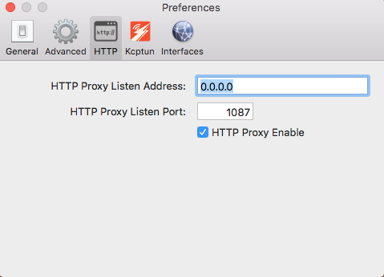
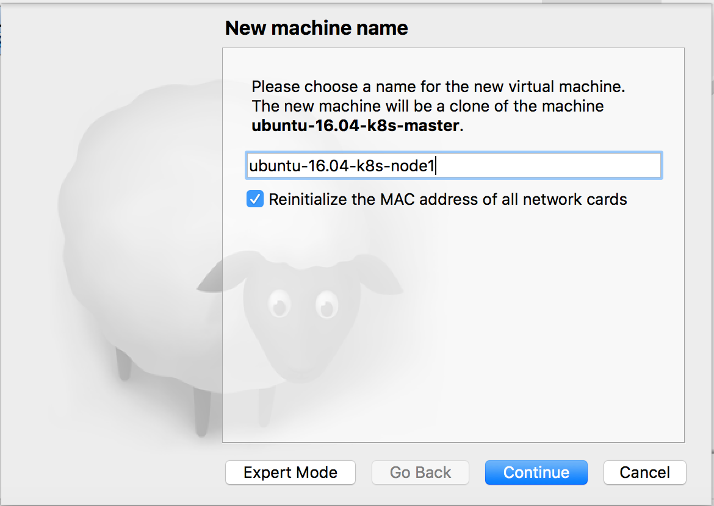

## 创建虚拟机集群

### 安装VirtualBox

在Host主机上下载并安装VirtualBox，此处使用5.2.12最新版本。

```bash
horance@host:~$ wget -c https://download.virtualbox.org/virtualbox/5.2.12/VirtualBox-5.2.12-122591-OSX.dmg
```

### 下载镜像

从Ubuntu官网上下载ubuntu-16.04.4-server-amd64.iso镜像，并挂载在宿主机的虚拟光驱上。


### 虚拟网卡1

为了使得虚拟机能够访问外网，创建第一个虚拟网卡(enp0s3)，配置Bridged的网络适配器，并在虚拟机安装过程中配置为主卡(Primary NIC)。


#### ShadowsocksX-NG客户端

在宿主机上开启代理服务器，用于代理所有虚机请求外网访问。




### 虚拟网卡2

基于Bridged的网络适配器，虚拟机是按照DHCP方式自动分配IP。因此，可以创建另外一张虚拟网卡，使用Host-only的网络适配器，静态分配每个宿主机和虚机的IP地址。

#### 宿主机

在宿主机上配置一张虚拟网卡，取消DHCP。VirtualBox自动分配IP地址`192.168.56.1`，并命名为vboxnet0。虚拟机使用vboxnet0的网段`192.168.56.0/24`的网段分配固定IP地址。

其中，`192.168.56.0/24`网段用于建立内部可以互相访问(Host与虚机，虚机与虚机)，而禁止外部访问(虚机访问外网，外网访问虚机)的集群。


#### 创建虚拟网卡2

创建第2张虚拟网卡，配置Host-only的网络适配器(enp0s8)，连接宿主机的`vboxnet0`虚拟网卡。


### 集群规划

此处，创建了3个节点的集群，分别为每个虚机创建Host Only的虚拟网卡(enp0s8)，规划如下。

#### ubuntu-16.04-master

- hostname: k8s-master
- user: horance
- enp0s8: 192.168.56.10

#### ubuntu-16.04-node1
 
- hostname: k8s-node1
- user: horance
- enp0s8: 192.168.56.20

#### ubuntu-16.04-node2
 
- hostname: k8s-node2
- user: horance
- enp0s8: 192.168.56.30

配置完成，开始启动第一个虚拟机的创建过程，待完成所有配置后，通过克隆方式快速创建另外两个虚拟机。

### 第一个虚拟机

在虚拟机安装过程中，按照提示及其集群规划信息，配置主机名，用户名和密码。待虚拟机安装成功，登录虚拟机进行简单配置。

```bash
k8s-master login: horance
Password:
horance@k8s-master:~$ 
```

#### 分配固定IP

分配`192.168.56.0/24`网段的静态IP给enp0s8网卡。

```bash
horance@k8s-master:~$ sudo vim /etc/network/interfaces
source /etc/network/interfaces.d/*

# The loopback network interface
auto lo
iface lo inet loopback

# The primary network interface
auto enp0s3
iface enp0s3 inet dhcp

# The secondary network interface
auto enp0s8
iface enp0s8 inet static
address 192.168.56.10
netmask 255.255.255.0
```

#### 名字服务

为了方便宿主机SSH到虚拟机，及其虚拟机配置宿主机开启的HTTP代理服务，在宿主机和所有虚拟机配置名字服务。例如在宿主机上，配置如下。

```bash
horance@host:~$ sudo vim /etc/hosts
192.168.56.1  host
192.168.56.10 k8s-master
192.168.56.20 k8s-node1
192.168.56.30 k8s-node2
```

在宿主机上，便可以使用虚拟机的主机名连接上去了，并执行相关配置。

```bash
horance@host:~$ ssh horance@k8s-master
horance@k8s-master's password:
Welcome to Ubuntu 16.04.4 LTS (GNU/Linux 4.4.0-116-generic x86_64)
Last login: Sat May 12 15:42:14 2018 from 192.168.56.1
horance@k8s-master:~$ 
```

同理，同样的配置实施于k8s-master虚机上，使得可以使用host的名字访问宿主机。

```bash
horance@k8s-master:~$ sudo vim /etc/hosts
192.168.56.1  host
192.168.56.10 k8s-master
192.168.56.20 k8s-node1
192.168.56.30 k8s-node2
```

#### 配置HTTP代理

如果要使用宿主机上提供的HTTP代理服务，执行相关如下配置。

```bash
horance@k8s-master:~$ vim ~/.bashrc
# setup proxy
alias proxy='export http_proxy=http://host:1087 && export https_proxy=$http_proxy && export socks5_proxy=socks5://host:1086 && rsync_proxy=$http_proxy && export ftp_proxy=$http_proxy'

# teardown proxy
alias unproxy='unset http_proxy https_proxy ftp_proxy socks5_proxy rsync_proxy'

# PodCIDR network: 10.244.0.0/16, HostOnly network: 192.168.56.0/24
export no_proxy=localhost,192.168.56.0/24,127.0.0.1,10.244.0.0/16
```

其中，`10.244.0.0/16`网段用于配置K8S集群中配置Pod网络；`192.168.56.0/24`网段用于配置宿主机和虚拟机之间的Host-only网络。使能配置，执行如下命令。

```bash
horance@k8s-master:~$ source ~/.bashrc
```

验证外网访问正常。

```bash
horance@k8s-master:~$ proxy
horance@k8s-master:~$ curl www.google.com
```

#### 配置APT

首先，配置apt的HTTP代理，此处使用宿主机的名字，而不是IP地址。

```bash
horance@k8s-master:~$ sudo vim /etc/apt/apt.conf
Acquire::http::Proxy "http://host:1087";
Acquire::https::Proxy "http://host:1087";
Acquire::ftp::Proxy "http://host:1087";
Acquire::socks5::Proxy "socks5://host:1086";
```

可以修改apt的在国内的软件源，加速下载速度。

```bash
horance@k8s-master:~$ sudo vim /etc/apt/sources.list
deb http://mirrors.163.com/ubuntu/ trusty main restricted universe multiverse
deb http://mirrors.163.com/ubuntu/ trusty-security main restricted universe multiverse
deb http://mirrors.163.com/ubuntu/ trusty-updates main restricted universe multiverse
deb http://mirrors.163.com/ubuntu/ trusty-proposed main restricted universe multiverse
deb http://mirrors.163.com/ubuntu/ trusty-backports main restricted universe multiverse
deb-src http://mirrors.163.com/ubuntu/ trusty main restricted universe multiverse
deb-src http://mirrors.163.com/ubuntu/ trusty-security main restricted universe multiverse
deb-src http://mirrors.163.com/ubuntu/ trusty-updates main restricted universe multiverse
deb-src http://mirrors.163.com/ubuntu/ trusty-proposed main restricted universe multiverse
deb-src http://mirrors.163.com/ubuntu/ trusty-backports main restricted universe multiverse
```

最后，更新本地apt仓库。

```bash
horance@k8s-master:~$ sudo apt-get update
```

#### 关闭SELinux

为了能够在虚机上启动kubelet服务，需要关闭相关SELinux的安全服务。

```bash
horance@k8s-master:~$ sudo apt install selinux-utils
horance@k8s-master:~$ sudo setenforce 0
```

为了永久生效配置，配置`SELINUX=permissive`；当虚机重启后，保持SELinux去激活状态。

```bash
horance@k8s-master:~$ sudo vi /etc/selinux/config
SELINUX=permissive
```

#### 关闭防火墙

```bash
horance@k8s-master:~$ sudo ufw disable
```

#### 配置内核参数

配置内核参数`net.bridge.bridge-nf-call-iptables`。

```bash
horance@k8s-master:~$ sudo vi /etc/sysctl.d/k8s.conf
"net.bridge.bridge-nf-call-iptables=1"
```

#### 关闭Swap

关闭Swap交换分区的功能，并在`/etc/fstab`文件注释swap分区，否则kubelet不能正常启动。

```bash
horance@k8s-master:~$ sudo swapoff -a 
horance@k8s-master:~$ sudo vi /etc/fstab
# <file system>                  <mount point> <type> <options> <dump> <pass>
# /dev/mapper/horance--vg-swap_1      none      swap     sw        0      0
```

#### 安装Docker

访问Docker官方网站，按照手册在虚拟机上安装和配置Docker服务。

##### 安装工具

```
horance@k8s-master:~$ sudo apt-get install apt-transport-https \
ca-certificates curl software-properties-common
```

##### 配置Docker源

添加Docker官方GPG。

```bash
horance@k8s-master:~$ curl -fsSL https://download.docker.com/linux/ubuntu/gpg | sudo apt-key add -
```

添加Docker的apt软件源。

```bash
horance@k8s-master:~$ sudo add-apt-repository \
   "deb [arch=amd64] https://download.docker.com/linux/ubuntu \
   $(lsb_release -cs) \
   stable"
```

更新本地apt仓库。

```bash
horance@k8s-master:~$ sudo apt-get update
```

##### 安装Docker

```bash
horance@k8s-master:~$ sudo apt-get install docker-ce
```

##### 配置代理

配置Docker的代理服务器。

```bash
horance@k8s-master:~$ sudo mkdir -p /etc/systemd/system/docker.service.d
horance@k8s-master:~$ sudo vi /etc/systemd/system/docker.service.d/http-proxy.conf
[Service]
Environment="HTTP_PROXY=http://host:1087"
Environment="HTTPS_PROXY=http://host:1087"
Environment="FTP_PROXY=http://host:1087"
```

重新加载配置，并重启Docker服务。

```bash
horance@k8s-master:~$ sudo systemctl daemon-reload
horance@k8s-master:~$ sudo systemctl restart docker
```

验证配置生效。

```bash
horance@k8s-master:~$ systemctl show --property=Environment docker　　
```

查看Docker服务状态。

```bash
horance@k8s-master:~$ sudo systemctl status docker
```

#### 安装K8S组件

##### 配置K8S源

添加Google官方的GPG。

```bash
horance@k8s-master:~$ curl -s https://packages.cloud.google.com/apt/doc/apt-key.gpg | sudo apt-key add -
```

添加Kubernetes的apt软件源。

```bash
horance@k8s-master:~$ sudo vim /etc/apt/sources.list.d/kubernetes.list
deb http://apt.kubernetes.io/ kubernetes-xenial main
```

更新本地apt仓库。

```bash
horance@k8s-master:~$ sudo apt-get update
```

##### 安装K8S组件

```bash
horance@k8s.master$ sudo apt-get install kubelet kubeadm kubectl
```

启动kubectl服务。

```bash
horance@k8s-master:~$ systemctl enable kubelet 
horance@k8s-master:~$ systemctl start kubelet
```

验证kubelet服务的状态信息。

```bash
horance@k8s-master:~$ sudo systemctl status kubelet
```

此时，kubelet服务启动应该是失败的，可以通过如下命令查看失败原因。

```
horance@k8s-master:~$ journalctl -xeu kubelet
```

如果因为缺失CA证书使得kubelet服务启动失败，可以不必理会。后续Master节点执行`kubeadm init`时会恢复kubelet失败的服务。

```
unable to load client CA file /etc/kubernetes/pki/ca.crt: open /etc/kubernetes/pki/ca.crt: no such file or directory
```

#### kubectl命令补全

kubectl是操作Kubernetes集群的命令行工具，可以通过添加命令补全的功能，方便操作命令。

```bash
horance@k8s-master:~$ cat <<EOF >> ~/.bashrc
source <(kubectl completion bash)
EOF
```

生效配置。

```bash
horance@k8s-master:~$ source ~/.bashrc
```

至此，ubuntu-k8s-master虚机的安装和配置基本完成，关闭虚机，保存镜像。

```bash
horance@k8s-master:~$ sudo shutdown now
```

### 克隆虚拟机

可以通过克隆镜像，迅速创建另外两个虚机，而不必重头再来一次配置。需要注意的是，克隆新的虚机时，需要重新初始化虚拟网卡的MAC地址，保证地址唯一性。



当克隆虚机成功后，因为该虚机克隆自k8s-master，此刻hostname依然为k8s-master, enp0s8的IP地址也保持为192.168.56.10。因此，登录成功后应该立即修改主机名，及其enp0s8的IP地址。

执行如下命令，修改该虚机的hostname。但是，此时Bash的hostname并没有立即生效，需要重启虚机才能生效。

```bash
horance@k8s-master:~$ sudo hostnamectl --static set-hostname k8s-node1
```

在重启之前，修改enp0s8网卡上的固定IP为192.168.56.20。

```bash
horance@k8s-master:~$ sudo vim /etc/network/interfaces
source /etc/network/interfaces.d/*

# The loopback network interface
auto lo
iface lo inet loopback

# The primary network interface
auto enp0s3
iface enp0s3 inet dhcp

# The secondary network interface
auto enp0s8
iface enp0s8 inet static
address 192.168.56.20
netmask 255.255.255.0
```

重启虚机，生效配置。此时，应该使用`k8s-node1`的名字SSH连接该虚拟机。

```bash
horance@host:~$ ssh horance@k8s-node1
horance@k8s-node1's password:
Welcome to Ubuntu 16.04.4 LTS (GNU/Linux 4.4.0-116-generic x86_64)
Last login: Thu May 17 06:54:23 2018 from 192.168.56.1
horance@k8s-node1:~$
```

以同样的方式，克隆创建最后一台虚拟机，修改主机名为node2-k8s，并配置enp0s8的IP地址为192.168.56.20。至此，3个节点的虚拟机集群创建成功。


